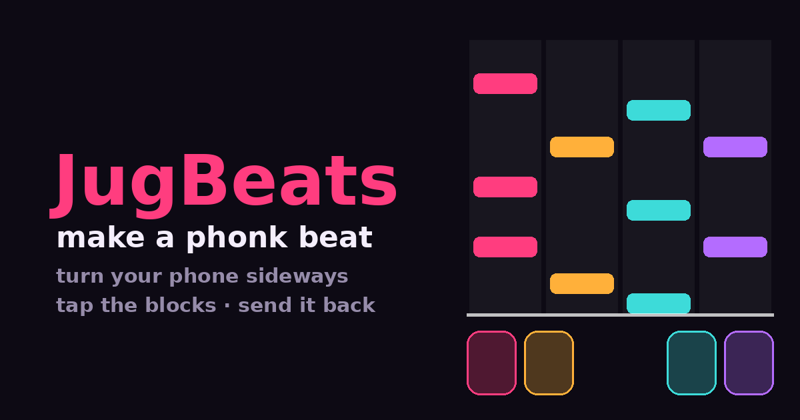

# JugBeats

**[Play it →](https://sligara7.github.io/jugbeats/)**

A phonk beat-making game. Turn your phone sideways, tap four keys, make
something, send it to someone.

Built for one nine-year-old who likes phonk and likes games where the notes
fall down the screen.



## How you play

Tap a key. The sound fires straight away and your tap is kept, so four bars
later it comes back round as a falling block. There is no record button,
because there is no moment where you are not doing both.

Four keys, grouped two under each thumb — the middle of a landscape phone is
where thumbs are not.

Once you have a beat going, the same four keys become the 808 and you play
bass over your own drums. Then the melody. Everything you made keeps playing
underneath. That is the whole of the teaching: nobody tells you a track is
drums plus bass plus melody, you hear it get fuller because you filled it.

The melody lanes are locked to a minor scale, so there is no wrong note.

## How it is built

Plain HTML, CSS and JavaScript. No framework, no dependencies, no build step,
no server, no accounts, nothing to pay for.

| | |
|---|---|
| `js/dsp.js` | The sound design. Pure functions, no Web Audio, no DOM. |
| `js/clock.js` | Musical time — the only part that knows what time it is. |
| `js/voices.js` | The sound engine. |
| `js/track.js` | Your music, as plain data. |
| `js/stage.js` | The highway and the keys. |
| `js/coach.js` | Decides what to put in front of you next. |
| `js/link.js` | Packs a track into a URL and back out. |
| `js/main.js` | The page. Constructs everything; nothing depends on it. |
| `forge/` | Build-time only. Bakes the drums; renders the preview card. |

**All the sound is synthesized** — no samples from anywhere. The drums are
rendered ahead of time by the forge, where there is no latency budget and the
sound design can be as expensive as it needs to be. The 808 and the lead are
generated in the browser, because their pitch has to move across the lanes and
a rendered file cannot. One sound-design pass, run at two speeds.

**Musical time has a single authority**, derived from the audio hardware clock.
Nothing else holds a timer, and a block's position on screen is computed from
the clock rather than advanced each frame — so a dropped frame loses a frame
and never the beat.

**Your track travels inside the link.** No server sees it. The format carries a
version marker, because a link you send today has to still play a year from now.

## Running it

```sh
node forge/build-kit.mjs      # bake the drums into kit/
node forge/demo.mjs demo.wav  # hear the kit without the game
python3 forge/preview.py      # render the chat preview card

node test/timing.mjs          # the beat does not drift
node test/link.mjs            # old links still play

python3 -m http.server 8137   # then open http://localhost:8137
```

On a desktop the four lanes are **D F J K**.

The files in `kit/` are generated but committed, because GitHub Pages serves
the repository as-is with no build step. `js/dsp.js` is the source of truth;
`node forge/build-kit.mjs` regenerates them byte for byte. Never hand-edit them.

## Design

Designed with [reflow2](https://github.com/sligara7/reflow2) before it was
built. The design graph — requirements, decisions and the reasoning behind
them — lives in `.reflow2/` and is not committed.

Two things worth knowing, because they explain most of the code:

- **Fun is the gate, and the creation shift is the prize.** The point is that
  she comes away knowing music is something a person makes. But a child who
  does not enjoy it stops playing, and then nothing is taught at all. Where the
  two pull apart, the more fun one wins.
- **The keys never reach back.** Every part publishes what it offers and imports
  only from parts below it. `main.js` constructs everything and nothing depends
  on it. Two dependency cycles got caught this way before a line of code existed.
